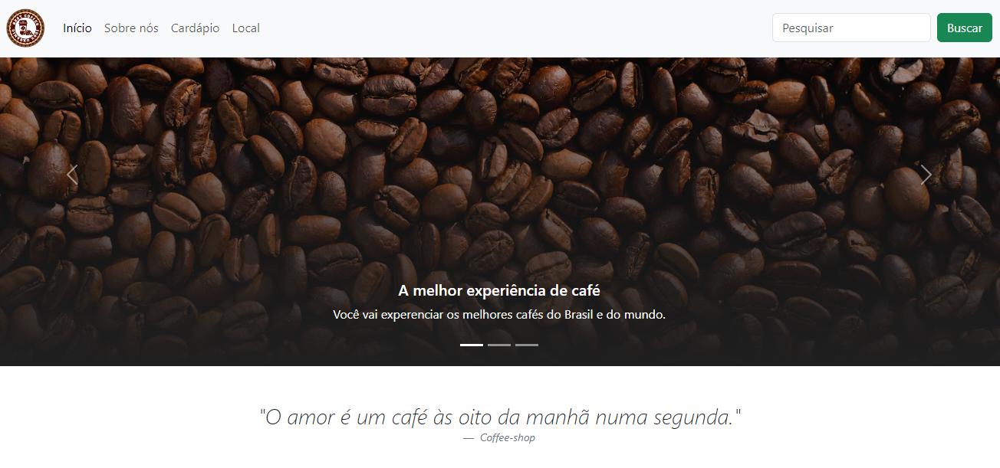
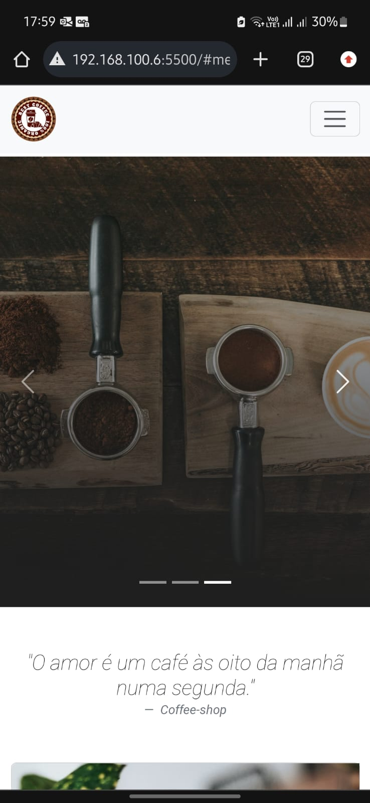

# ☕ Coffee Shop Website

Bem-vindo ao repositório do Coffee Shop, onde transformamos sua experiência com café em algo extraordinário! 🌟

## 📖 Sobre o Projeto

Este projeto é um site moderno e responsivo para um coffee shop. Nosso objetivo é proporcionar uma experiência única e agradável para os amantes de café, com uma navegação intuitiva e um design atraente.

## 🚀 Funcionalidades

- **Navbar Fixa**: Navegação rápida e fácil de qualquer lugar na página.
- **Carrossel Interativo**: Destaque dos melhores cafés e ambientes do nosso coffee shop.
- **Seção Sobre Nós**: Conheça mais sobre nossa paixão por café e nossa equipe de baristas.
- **Cardápio Diversificado**: Explore uma variedade de expressos, cappuccinos, cafés gelados e especiais.
- **Localização**: Encontre-nos facilmente com um mapa interativo integrado.
- **Pesquisa**: Encontre rapidamente o que você está procurando.

## 🛠️ Tecnologias Utilizadas

- HTML5
- CSS3
- Bootstrap 5
- JavaScript

## 🎨 Design Responsivo

O site foi desenvolvido para ser totalmente responsivo, garantindo uma experiência agradável em qualquer dispositivo, seja desktop, tablet ou celular.

## 🌍 Deploy

Você pode acessar o site em [URL do Site].

## 🖼️ Demonstração do Layout

### Layout Desktop 🖥️:

### Layout Mobile 📱:

